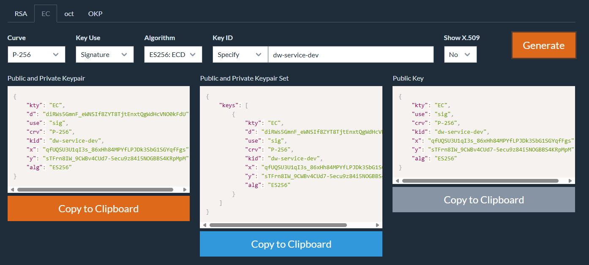
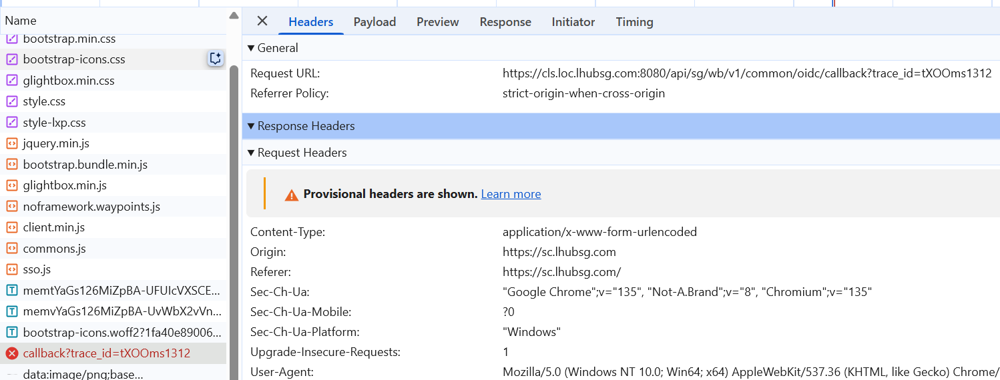
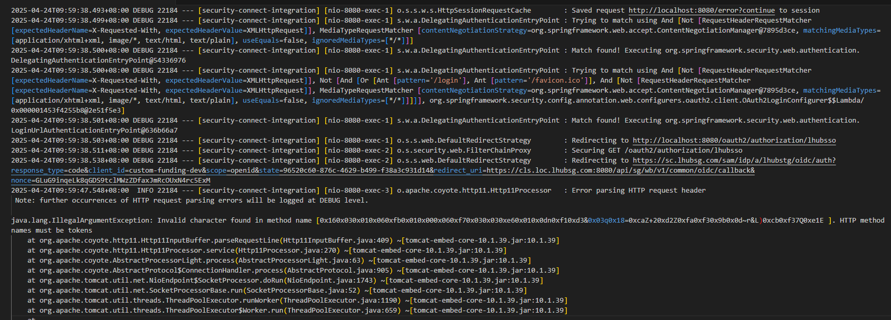

# 1、配置private-key.pem

需求描述：

```
Note: We will be using client assertion which your end will sign the assertion
```

报错：

```
org.springframework.beans.factory.BeanCreationException: Error creating bean with name 'jwtEncoder' defined in class path resource [com/grey/sso/demo/config/SsoConfig.class]: Failed to instantiate [org.springframework.security.oauth2.jwt.JwtEncoder]: Factory method 'jwtEncoder' threw exception with message: keys\private-key.pem
```

解决：使用下面这个开源、安全的 JWT / JWK 密钥生成器，支持各种算法（RSA, EC, HMAC）

```
https://mkjwk.org/
```



Public and Private Keypair

```
{
    "kty": "EC",
    "d": "diRWs5GmnF_eWNSIf8ZYT8TjtEnxtQgWdHcVNO0kFdU",
    "use": "sig",
    "crv": "P-256",
    "kid": "dw-service-dev",
    "x": "qfUQSU3U1qI3s_86xHh84MPYfLPJDk3SbG1SGYqfFgs",
    "y": "sTFrn8IW_9CWBv4CUd7-5ecu9z84i5NOGBBS4KRpMpM",
    "alg": "ES256"
}
```

上面内容存入：`src/main/resources/keys/private-key.pem`

Public Key

```
{
    "kty": "EC",
    "use": "sig",
    "crv": "P-256",
    "kid": "dw-service-dev",
    "x": "qfUQSU3U1qI3s_86xHh84MPYfLPJDk3SbG1SGYqfFgs",
    "y": "sTFrn8IW_9CWBv4CUd7-5ecu9z84i5NOGBBS4KRpMpM",
    "alg": "ES256"
}
```

将上面的 Public Key 发给sso team 的同事。只要你点击 SSO 登录页并授权，就能看到 `private-key.pem` 正式被用上


```
curl -vk "https://sc.lhubsg.com/sam/idp/a/lhubstg/oidc/auth?response_type=code&client_id=custom-funding-dev&scope=openid&state=ce6321a1-65ce-47a0-956a-1e28c46ff9d5&redirect_uri=https://cls.loc.lhubsg.com:8080/api/sg/wb/v1/common/oidc/callback&nonce=PFmvVQG9rvO6NEcjHSYBEewMbAe9O1-UAyvfDxosDVI"
```


# 2、配置https

跳转到SSO 输入用户名和密码后，下面的url 报错：






### 方案 A —— 给 Spring Boot 打开 SSL

1. **生成自签名证书**（开发用）

```
keytool -genkeypair -alias myapp -keyalg RSA -keysize 2048 -storetype PKCS12 -keystore keystore.p12 -validity 3650 -storepass changeit -dname "CN=cls.loc.lhubsg.com"
```

执行完以后，会生成

- 一个 `keystore.p12` 文件，放在当前目录
- 密码为：`changeit`
- 证书别名：`myapp`
- 有效期：10 年
- 主题：`CN=cls.loc.lhubsg.com`

将证书放到

```
src/main/resources/ssl/keystore.p12
```

修改 `application.yml` 启用 HTTPS

```
server:
  port: 8080            
  ssl:
    enabled: true
    key-store: classpath:ssl/keystore.p12
    key-store-password: changeit  # ${KEYSTORE_PASS}    走环境变量 
    key-store-type: PKCS12
```

启动日志应显示监听 `8443` 端口

访问地址变为：

```
https://localhost:8080/
https://localhost:8443/oauth2/authorization/lhubsso
```

 
